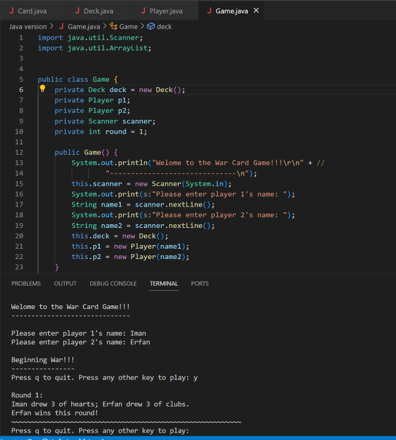

# "War" Card Game Project

**Project Completion Date:** December 2023

## Overview

"War" is a classic two-player card game that is simple yet exciting. The objective is to win the most number of rounds!

## Project Details

I have implemented this game in both Java and Python, so feel free to try either version.

### Java Version

- **Language:** Java
- **Key Components:** 
  - Custom "Card" class
  - Comprehensive "Deck" class to manage the game
  - Interactive text-based interface in the "Game" class
- **Game Features:**
  - Players can draw cards.
  - Resolve ties ("War") according to the game's rules.
  - Determine the ultimate winner.
  
### Python Version

- **Language:** Python
- **Key Components:**
  - Custom "Card" class
  - Comprehensive "Deck" class to handle game mechanics
  - Interactive text-based interface in the "Game" class
- **Game Features:**
  - Players can draw cards.
  - Resolve ties ("War") following the game's rules.
  - Determine the overall winner.

## Rules and Gameplay

### Pre-game Notes:

- The Ace is the highest-ranked card in this game.
- The suits are ranked differently as well. Here are the suits from strongest to weakest:
  
  - Clubs - 4 points
  - Diamonds - 3 points
  - Hearts - 2 points
  - Spades - 1 point

### Setup:

- A standard 52-card deck is divided equally between two players.
- Each player receives their stack of cards, face down.

### Gameplay:

**The Deal:**

- Players simultaneously reveal the top card of their stack.
- The player with the higher-ranked card (the higher-number card) wins that round of the game.

**Ties ("War"):**

- If the revealed cards are of equal rank, a "war" is declared.
- Then, the player with the higher-ranked suit wins that round of the game.

**Winning the Game:**

- The game continues until there are no more cards left.
- The player with the most won rounds wins the game.

## Credit

This project was inspired by Cory Althoff, the author of "The Self-taught Programmer". To view Cory's version of the game, you can visit this [link](http://tinyurl.com/ho7364a).

## Usage

You can explore and run both the Java and Python versions of the "War" card game by navigating to their respective directories within this repository. Follow the instructions provided when running each version to play the game.

Happy gaming!

